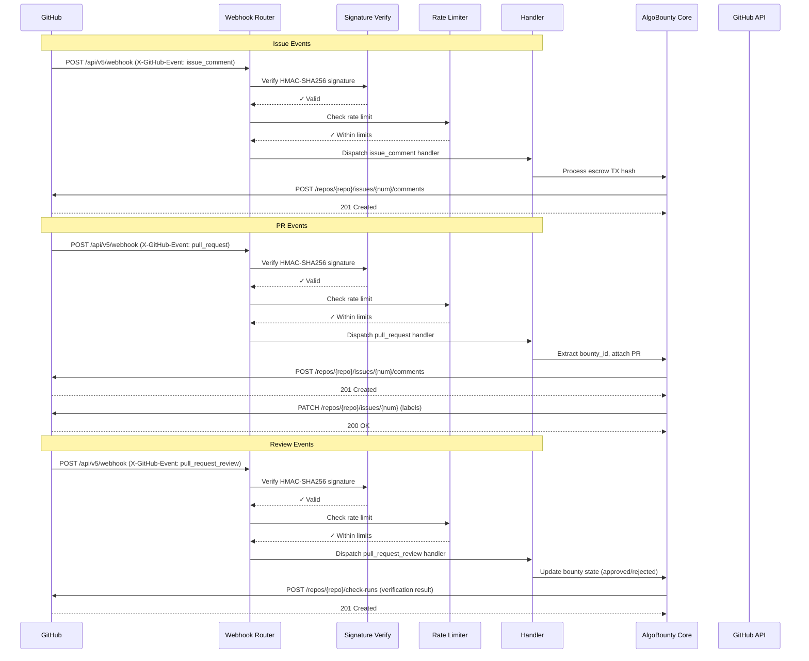
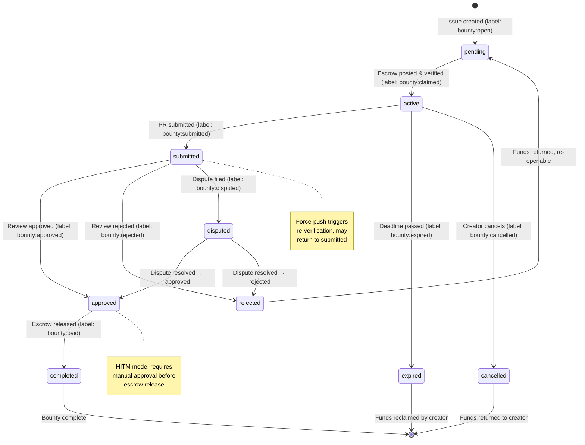

# AlgoBounty v5 — GitHub Integration Design Document

**Version:** 5.0.0  
**Status:** Final Design  
**Created:** 2025-01-15  
**Parent Specs:** v4 Dashboard & API, v6 HITM Mode, v2 Karma System, v3 Verification

---

## Table of Contents

1. [Overview & Goals](#1-overview--goals)
2. [Architecture Overview](#2-architecture-overview)
3. [Bounty-from-Issue Flow](#3-bounty-from-issue-flow)
4. [PR Auto-Detection](#4-pr-auto-detection)
5. [Auto-PR Submission](#5-auto-pr-submission)
6. [Milestone & Labeled Workflow](#6-milestone--labeled-workflow)
7. [Webhook Hooks](#7-webhook-hooks)
8. [Escrow Release Policies](#8-escrow-release-policies)
9. [Failure Recovery](#9-failure-recovery)
10. [GitHub Actions CI/CD Integration](#10-github-actions-cidc-integration)
11. [Rate Limiting & Security](#11-rate-limiting--security)
12. [API Endpoints for GitHub Integration](#12-api-endpoints-for-github-integration)
13. [Data Models](#13-data-models)
14. [Migration & Deployment](#14-migration--deployment)
15. [Diagram: Full Workflow](#15-diagram-full-workflow)

---

## 1. Overview & Goals

### 1.1 Problem Statement

AlgoBounty v5 bridges the gap between GitHub's collaborative workflow and Algorand's escrow-based bounty system. Currently, bounty workflows require manual linking between GitHub issues/PRs and Algorand transactions. This design introduces a bidirectional integration where:

- **GitHub becomes the UX layer** — Issue creation, PR submission, labeling, and milestone tracking happen in GitHub.
- **Algorand becomes the trust layer** — Escrow contracts, fund locking, and automatic release are handled on-chain.

### 1.2 Goals

| Goal | Description |
|------|-------------|
| G1 | Seamless issue-to-bounty conversion via bot interaction |
| G2 | Automatic PR-bounty linking via PR title/body references |
| G3 | GitHub label state synced with escrow contract state |
| G4 | Webhook-driven real-time state transitions (no polling) |
| G5 | Clear, auditable escrow release policies (auto + HITM) |
| G6 | Robust failure recovery for webhook delivery gaps |
| G7 | CI/CD integration via GitHub Actions for automated verification |
| G8 | Security — webhook signature validation, rate limiting, spam prevention |

### 1.3 Non-Goals

- Full issue tracking replacement (AlgoBounty augments, not replaces GitHub issues)
- Direct Algorand wallet management via GitHub (wallet management stays outside GitHub)
- Native GitHub SSO integration (OAuth2/Telegram auth remains the auth layer)

---

## 2. Architecture Overview

### 2.1 Component Diagram

```
┌─────────────────────────────────────────────────────────────────────┐
│                        GitHub Platform                               │
│  ┌──────────┐  ┌──────────┐  ┌──────────┐  ┌───────────────────┐   │
│  │  Issues  │  │    PRs   │  │Labels/Mi │  │  GitHub Actions   │   │
│  └────┬─────┘  └────┬─────┘  └────┬─────┘  └────────┬────────┘   │
│       │              │              │                │             │
│       └──────────────┴──────────────┴────────────────┘             │
│                           Webhooks                                  │
└──────────────────────────────┬──────────────────────────────────────┘
                               │
                               ▼
┌─────────────────────────────────────────────────────────────────────┐
│                    AlgoBounty Webhook Server                         │
│  ┌─────────────────────────────────────────────────────────────┐    │
│  │                     Webhook Router                           │    │
│  │  • Verify HMAC-SHA256 signature (X-Hub-Signature-256)        │    │
│  │  • Parse event type & action                                 │    │
│  │  • Rate limit (configurable per IP, per repo)                │    │
│  └──────────┬──────────────────────────────────┬────────────────┘    │
│             │                                  │                     │
│             ▼                                  ▼                     │
│  ┌──────────────────┐           ┌──────────────────────────┐       │
│  │ Issue Handler     │           │ PR Handler                │       │
│  │ • Bounty link gen │           │ • Bounty ID extraction   │       │
│  │ • Comment post    │           │ • Auto-attach to escrow  │       │
│  │ • Label sync      │           │ • State tracking         │       │
│  └────────┬──────────┘           └──────────┬───────────────┘       │
│           │                                  │                       │
│           ▼                                  ▼                       │
│  ┌─────────────────────────────────────────────────────────────┐    │
│  │                  State Engine (AlgoBounty Core)               │    │
│  │  • Sync: GitHub label ↔ Escrow contract state                │    │
│  │  • Bounty lifecycle: open → claimed → submitted → reviewed   │    │
│  │  • HITM mode integration (v6)                                │    │
│  │  • Karma scoring (v2) integration                            │    │
│  └──────────┬──────────────────────────────────┬────────────────┘    │
│             │                                  │                     │
│             ▼                                  ▼                     │
│  ┌──────────────────┐           ┌──────────────────────────┐       │
│  │ Algorand Client   │           │ GitHub API Client         │       │
│  │ • Escrow contract │           │ • Post comments           │       │
│  │ • State queries   │           │ • Update labels           │       │
│  │ • Release funds   │           │ • Merge/label PRs         │       │
│  └──────────────────┘           └──────────────────────────┘       │
│                                                                     │
│  ┌─────────────────────────────────────────────────────────────┐    │
│  │                  AlgoBounty GitHub App                       │    │
│  │  • Installable on any org/repo                               │    │
│  │  • Permissions: issues, pull_requests, contents, metadata    │    │
│  │  • Webhook secret managed in app settings                    │    │
│  └─────────────────────────────────────────────────────────────┘    │
└─────────────────────────────────────────────────────────────────────┘
```

### 2.2 Integration Points

| Integration | Mechanism | Direction |
|-------------|-----------|-----------|
| GitHub → AlgoBounty | Webhooks (POST `POST /api/v5/webhook`) | Push |
| AlgoBounty → GitHub | GitHub REST API v3 + GraphQL | Push |
| Algorand → AlgoBounty | Block explorer polling / Algorand indexers | Polling (5s interval) |
| AlgoBounty → Algorand | algopy / py-algorand-sdk | Push |

### 2.3 AlgoBounty GitHub App Requirements

```yaml
app_manifest:
  name: "AlgoBounty Bot"
  url: "https://algorand.org"
  description: "Automated bounty escrow and verification on Algorand"
  redirect_urls:
    - "https://dashboard.algobounty.io/oauth/callback"
  webhook_secret: "<generated>"
  public: false
  request_oauth_on_install: false
  setup_url: "https://dashboard.algobounty.io/github/install"
  
  events:
    - issue_comment
    - issues
    - pull_request
    - pull_request_review
    - pull_request_review_comment
    - pull_request_target
    - check_run
    - check_suite
    - label

  permissions:
    issues: write
    pull_requests: write
    contents: read        # Read PR diff for verification
    metadata: read        # Repo metadata
    checks: write         # GitHub Actions check results
    workflows: write      # Trigger Actions for bounty verification
    members: read         # For karma attribution
```

---

## 3. Bounty-from-Issue Flow

### 3.1 Flow Description

The bounty-from-issue flow enables bounty creators to start a bounty directly from a GitHub issue, with the AlgoBounty bot handling the conversion.

### 3.2 Step-by-Step Process

```
┌──────────────┐     ┌──────────────┐     ┌──────────────┐
│  1. Creator  │     │  2. Bot      │     │  3. Creator  │
│  posts issue │────▶│  posts comment│────▶│  posts escrow│
│  on GitHub   │     │  with link   │     │  txn hash    │
└──────────────┘     └──────────────┘     └──────┬───────┘
                                                  │
┌──────────────┐     ┌──────────────┐     ┌──────▼───────┐
│  8. GitHub   │     │  7. Bot      │     │  6. Bot      │
│  labels sync │◀────│  6. Bot sync │◀────│  5. Escrow   │
│  labels      │     │  labels      │     │  posted      │
└──────────────┘     └──────────────┘     └──────────────┘
```

**Step 1 — Issue Creation**

Creator opens a GitHub issue with:
- **Label:** `bounty:open` (manually added or auto-applied by repo rules)
- **Title format:** Optional `[Bounty]` prefix — bot detects pattern
- **Body template:** (optional repo issue form) structured YAML for bounty details

```yaml
---
bounty:
  title: "Implement X feature"
  reward: "1000 ALGO"
  deadline: "2025-02-15"
  submission_type: "PR"
  tags: ["feature", "teal"]
---

## Description
[Bounty description here]
```

**Step 2 — Bot Detection & Comment**

The AlgoBounty bot listens for `issues` events with action `opened`.

Detection rules:
1. Issue has label `bounty:open` (primary signal)
2. Issue body contains `bounty:` YAML frontmatter (secondary signal)
3. Issue title starts with `[Bounty]` (tertiary signal)

When detected, the bot posts a comment:

```markdown
> 💰 **AlgoBounty Bounty Detected**
> 
> **Bounty ID:** `#AB-2025-0115-4a3f`
> **Reward:** 1,000 ALGO (~$45.00 USD)
> **Deadline:** 2025-02-15
> 
> [🔒 Post Escrow](https://dashboard.algobounty.io/bounty/AB-2025-0115-4a3f/post?repo=username/repo&issue=42)
> 
> 💡 Click the link above to post your escrow transaction on Algorand.
> After posting, reply to this comment with the transaction hash.
> 
> ---
> _Generated by [AlgoBounty](https://algobounty.io) v5_
```

**Step 3 — Creator Posts Escrow**

Creator visits the dashboard, creates an Algorand escrow contract, and posts the transaction hash.

**Step 4 — Bot Verifies Escrow**

Bot validates the transaction:
```json
{
  "bounty_id": "AB-2025-0115-4a3f",
  "tx_id": "MTXHASH7X...",
  "from_address": "ABCD1234...",
  "to_address": "ESCREWADDR...",
  "amount": 1000000000,  // microALGO (1000 ALGO)
  "contract_type": "bounty",
  "status": "verified"
}
```

**Step 5 — Escrow Confirmed**

On-chain escrow is confirmed (block confirmations ≥ 1 for Algorand).

**Step 6 — State Sync to GitHub**

Bot updates the GitHub issue:
- Adds label `bounty:claimed`
- Removes label `bounty:open`
- Posts a comment with escrow TX link

```markdown
> ✅ **Escrow Confirmed**
> 
> Bounty `AB-2025-0115-4a3f` is now active.
> Escrow TX: [TxID](https://algoexplorer.io/tx/MTXHASH7X)
> Funds are locked in escrow contract.
> 
> 📌 Submitters: Open a PR referencing `#AB-2025-0115-4a3f` to claim this bounty.
```

**Step 7 — Issue State Updates**

Bot may also:
- Auto-assign the issue to the bounty creator
- Add milestone "Bounty Q1 2025"
- Set issue priority

**Step 8 — Continuous Label Sync**

Subsequent events (PR submission, approval, payment) update labels automatically.

### 3.3 Issue Comment Types

| Comment Type | Trigger | Content |
|-------------|---------|---------|
| `bounty-detected` | Issue opened with bounty label | Bounty link, details |
| `escrow-confirmed` | Escrow TX verified on-chain | TX hash, active status |
| `submission-received` | PR referencing bounty opened | PR link, review status |
| `payment-initiated` | Bounty creator triggers release | Payment TX reference |
| `payment-complete` | Escrow released successfully | TX hash, completion |
| `dispute-opened` | Dispute filed (v3) | Dispute details, timeline |
| `status-update` | Any state change | Brief status summary |

---

## 4. PR Auto-Detection

### 4.1 Flow Description

When a developer opens a PR that references an active bounty, the system automatically attaches the PR to the corresponding escrow contract.

### 4.2 Bounty ID Extraction

The bot parses PR metadata for bounty references using this priority order:

```
Priority 1: Issue reference with bounty label
  - PR links to an issue labeled `bounty:*`
  - `refs/issues/#N` in PR body
  - Auto-fetches linked issue's bounty_id

Priority 2: Explicit bounty ID in PR body
  - Pattern: `#AB-YYYY-MMDD-HASH` (e.g., `#AB-2025-0115-4a3f`)
  - Regex: `#AB-\d{4}-\d{2}\d{2}-[0-9a-f]{4}`
  - Also matches: `AlgoBounty: AB-2025-0115-4a3f`

Priority 3: PR title with bounty ID
  - Pattern: `[Bounty: AB-2025-0115-4a3f] Fix X issue`
  - Regex: `\[Bounty:\s*(#AB-\S+)\]`

Priority 4: Issue number resolution
  - PR body references `#N` (issue number)
  - System checks if issue has `bounty:*` label
  - Resolves to bounty_id if found
```

### 4.3 Auto-Attach Process

```
┌─────────────────────────────────────────────────┐
│  PR Opened with Bounty Reference                │
└──────────────────────┬──────────────────────────┘
                       ▼
            ┌────────────────────┐
            │ Extract Bounty ID  │
            │ (4 strategies)     │
            └────────┬───────────┘
                     ▼
            ┌────────────────────┐
            │ Verify Escrow      │
            │ State: claimed     │
            └────────┬───────────┘
                     ▼
            ┌────────────────────┐
            │ Auto-Attach PR to  │
            │ Escrow Contract    │
            └────────┬───────────┘
                     ▼
            ┌────────────────────┐
            │ Post Comment on    │
            │ PR + Update Labels │
            └────────────────────┘
```

### 4.4 PR Comment on Auto-Attachment

When a PR is successfully attached to a bounty:

```markdown
> 📌 **AlgoBounty: Bounty Attached**
> 
> **Bounty ID:** `#AB-2025-0115-4a3f`
> **Escrow:** 1,000 ALGO locked ✅
> **Status:** `submitted` → Awaiting review
> 
> **Next Steps:**
> 1. Maintainer reviews the PR
> 2. Approval triggers escrow release to submitter
> 3. Karma points awarded on completion
> 
> **Escrow TX:** [View](https://algoexplorer.io/tx/MTXHASH7X)
> 
> ---
> _This PR is linked to AlgoBounty bounty #AB-2025-0115-4a3f_
```

### 4.5 PR Label Sync

| GitHub Action | Label Change |
|---------------|-------------|
| PR opened with bounty ref | Add `algobounty:submitted` |
| PR review submitted + approved | Add `algobounty:approved`, remove `algobounty:submitted` |
| PR review rejected | Add `algobounty:rejected`, remove `algobounty:submitted` |
| PR merged + approved | Add `algobounty:paid` |
| PR force-pushed after submission | Re-verify diff (re-attach) |
| PR closed without merge (rejected) | Remove all `algobounty:` labels, add `bounty:open` if reusable |

---

## 5. Auto-PR Submission

### 5.1 Agent PR Submission

When an AI agent (or automated system) submits work via PR:

```json
{
  "event": "pr.submitted",
  "data": {
    "bounty_id": "AB-2025-0115-4a3f",
    "pr_number": 47,
    "repo": "username/repo",
    "submitter": {
      "agent_id": "agent-coding-73240",
      "github_user": "algobounty-agent[bot]",
      "karma_score": 4500
    },
    "diff_stats": {
      "insertions": 127,
      "deletions": 12,
      "files_changed": 3
    },
    "verification": {
      "tests_passed": true,
      "lint_passed": true,
      "typecheck_passed": true,
      "ci_status": "success"
    }
  }
}
```

### 5.2 PR Metadata Tracking

The system tracks the following PR metadata on the bounty record:

```yaml
pr_tracking:
  pr_url: "https://github.com/username/repo/pull/47"
  pr_number: 47
  pr_state: "open"           # open | closed | merged
  pr_merged_at: "2025-01-20T14:30:00Z"  # null if not merged
  pr_merged_by: "maintainer-username"   # null if not merged
  pr_review_state: "approved"  # pending | approved | rejected | changes_requested
  pr_diff_hash: "sha256:abc123..."   # Hash of submitted diff for audit
  pr_commits: 3
  pr_has_force_push: false       # True if force-pushed after initial submission
  submission_time: "2025-01-20T12:00:00Z"
  last_reviewed_at: "2025-01-20T14:30:00Z"
```

### 5.3 PR Status Tracking

```
PR State Machine:

          ┌──────────┐
          │ submitted │◀── PR opened with bounty ref
          └────┬─────┘
               │
       ┌───────┼──────────┬──────────┐
       ▼       ▼          ▼          ▼
  ┌────────┐ ┌───────┐ ┌───────┐ ┌──────────┐
  │reviewed │ │reject │ │ changes│ │ force-push│
  │+approved│ │+closed│ │request │ │ + re-ver │
  └───┬────┘ └───────┘ └───────┘ └────┬─────┘
      │                                │
      ▼                                ▼
  ┌──────────┐                ┌──────────┐
  │ merged   │                │ resubmit │
  │+pending  │                │ → reviewed│
  │ payment  │                └──────────┘
  └───┬──────┘
      │
      ▼
  ┌──────────┐
  │ paid     │◀── Escrow released
  └──────────┘
```

---

## 6. Milestone & Labeled Workflow

### 6.1 Label Taxonomy

All labels follow a consistent naming convention:

```
bounty:<state>          — Primary bounty state labels
algobounty:<action>     — Action/state labels on PRs
priority:<level>        — Priority labels (v6 HITM integration)
difficulty:<level>      — Difficulty labels
```

#### Primary Bounty State Labels (on Issues)

| Label | Color | Meaning | Escrow State |
|-------|-------|---------|-------------|
| `bounty:open` | `#0075ca` (blue) | Bounty created, escrow not posted | `pending` |
| `bounty:claimed` | `#6e40c9` (purple) | Escrow posted, awaiting submission | `active` |
| `bounty:submitted` | `#d4c5f9` (light purple) | PR submitted, awaiting review | `submitted` |
| `bounty:approved` | `#144429` (green) | Work accepted, release pending | `approved` |
| `bounty:paid` | `#28a745` (green) | Escrow released, bounty complete | `completed` |
| `bounty:disputed` | `#d73a49` (red) | Dispute filed, funds frozen | `disputed` |
| `bounty:expired` | `#e4e669` (yellow) | Deadline passed, no submission | `expired` |
| `bounty:cancelled` | `#6c757d` (gray) | Creator cancelled bounty | `cancelled` |
| `bounty:rejected` | `#b60205` (dark red) | Submission rejected, funds returnable | `rejected` |

#### PR Action Labels (on PRs)

| Label | Color | Meaning |
|-------|-------|---------|
| `algobounty:submitted` | `#d4c5f9` | PR attached to escrow |
| `algobounty:under-review` | `#fbca04` | Review in progress |
| `algobounty:approved` | `#144429` | Review approved |
| `algobounty:rejected` | `#b60205` | Review rejected |
| `algobounty:claimed` | `#0e8a16` | Payment claimed |
| `algobounty:auto-close` | `#a2eeef` | Suggest auto-close after paid |

### 6.2 Label Sync Logic

```python
def sync_labels(issue, escrow_state):
    """
    Sync GitHub issue labels with escrow contract state.
    """
    label_map = {
        "pending":       ["bounty:open"],
        "active":        ["bounty:claimed"],
        "submitted":     ["bounty:submitted"],
        "approved":      ["bounty:approved"],
        "completed":     ["bounty:paid"],
        "disputed":      ["bounty:disputed"],
        "expired":       ["bounty:expired"],
        "cancelled":     ["bounty:cancelled"],
        "rejected":      ["bounty:rejected"],
    }
    
    state_labels = label_map.get(escrow_state, [])
    
    # Remove all bounty state labels first
    existing_bounty_labels = [l for l in issue.labels 
                              if l.startswith("bounty:")]
    remove_labels(existing_bounty_labels)
    
    # Add current state labels
    add_labels(state_labels)
    
    # Add algobounty:claimed on PRs
    if escrow_state in ("submitted", "approved", "completed", "disputed"):
        add_labels_on_pr("algobounty:claimed")
```

### 6.3 Milestone Integration

Milestones are used for organizational tracking:

```yaml
milestone_policy:
  naming: "AlgoBounty {Quarter} {Year}"
  example: "AlgoBounty Q1 2025"
  auto_create: true                  # Auto-create if missing
  auto_assign_issue: true            # Auto-assign issues with bounty:labels
  milestone_progress: true           # Show bounty completion % in milestone
  
  milestone_labels:
    total_bounties: "bounty:total"
    active_bounties: "bounty:claimed"
    completed_bounties: "bounty:paid"
```

---

## 7. Webhook Hooks

### 7.1 GitHub → AlgoBounty Webhooks

AlgoBounty receives the following GitHub webhook events:

#### 7.1.1 `issue_comment`

**Trigger:** Comment posted on an issue (especially escrow TX hash reply)

```json
{
  "action": "created",
  "issue": {
    "number": 42,
    "title": "[Bounty] Implement X feature",
    "labels": [{"name": "bounty:open"}, {"name": "bug"}],
    "state": "open",
    "html_url": "https://github.com/username/repo/issues/42"
  },
  "comment": {
    "id": 12345678,
    "body": "Escrow posted: MTXHASH7X...",
    "user": {"login": "bounty-creator"}
  },
  "repository": {
    "name": "repo",
    "full_name": "username/repo",
    "html_url": "https://github.com/username/repo"
  },
  "sender": {"login": "bounty-creator"}
}
```

**Handler:** `handle_issue_comment_created()`
1. Parse comment body for escrow TX hash
2. Extract issue number and bounty_id
3. Verify escrow on-chain
4. Update labels + post confirmation comment

#### 7.1.2 `issues`

**Triggers:** `opened`, `edited`, `closed`, `reopened`, `labeled`, `unlabeled`

```json
// Example: labeled event
{
  "action": "labeled",
  "issue": {
    "number": 42,
    "title": "[Bounty] Implement X feature",
    "labels": [{"name": "bounty:open"}],
    "state": "open"
  },
  "label": {"name": "bounty:open", "color": "0075ca"},
  "repository": {"full_name": "username/repo"},
  "sender": {"login": "bounty-creator"}
}
```

**Handler:** `handle_issues_labeled()`
- On `bounty:open` → post bounty comment with link
- On `bounty:claimed` → escrow confirmed, notify
- On `bounty:disputed` → trigger dispute workflow
- On `bounty:cancelled` → release escrow back to creator

#### 7.1.3 `pull_request`

**Triggers:** `opened`, `synchronize` (force push), `closed`, `reopened`, `edited`, `ready_for_review`

```json
// Example: opened event
{
  "action": "opened",
  "pull_request": {
    "number": 47,
    "title": "Implement X feature",
    "body": "Fixes #42\n\nRef: #AB-2025-0115-4a3f\n\n## Changes\n[...]",
    "state": "open",
    "merged": false,
    "mergeable": true,
    "base": {"ref": "main", "repo": {"full_name": "username/repo"}},
    "head": {"ref": "feature-x", "repo": {"full_name": "username/repo"}},
    "user": {"login": "developer1"},
    "html_url": "https://github.com/username/repo/pull/47"
  },
  "repository": {"full_name": "username/repo"},
  "sender": {"login": "developer1"}
}
```

**Handler:** `handle_pull_request_opened()`
1. Extract bounty_id from PR body/title
2. Verify bounty exists and escrow is `active` or `submitted`
3. Auto-attach PR to escrow
4. Post "Bounty Attached" comment on PR
5. Update issue labels
6. Add `algobounty:submitted` label to PR

#### 7.1.4 `pull_request_review`

**Triggers:** `submitted` (approve/reject/request changes)

```json
{
  "action": "submitted",
  "pull_request": {"number": 47, "merged": false, "state": "open"},
  "review": {
    "id": 987654,
    "state": "APPROVED",   // APPROVED | CHANGES_REQUESTED | COMMENTED | DISMISSED
    "body": "Looks great! ✅",
    "user": {"login": "maintainer"},
    "submitted_at": "2025-01-20T14:30:00Z"
  },
  "repository": {"full_name": "username/repo"}
}
```

**Handler:** `handle_pull_request_review_submitted()`
- `APPROVED` → Trigger approval flow, update state to `approved`
- `CHANGES_REQUESTED` → Set state to `changes_requested`, notify submitter

#### 7.1.5 `pull_request_review_comment`

**Triggers:** Comment posted on a PR diff

Used for detailed review feedback. Bot monitors for specific patterns:
- `/algobounty approve` → Explicit approve command
- `/algobounty reject` → Explicit reject command

#### 7.1.6 `pull_request_target` (read-only)

**Trigger:** PR events, used for reading PR content from forked repos.

This is the recommended event for PR handling when the repo allows forks, as it checks out the PR merge commit in a secure context.

#### 7.1.7 `label`

**Triggers:** When labels on issues or PRs are created/edited/deleted

**Handler:** `handle_label_event()` — Reconciles any label drift between GitHub and AlgoBounty.

### 7.2 AlgoBounty → GitHub Notifications

When AlgoBounty state changes, it triggers GitHub notifications:

```json
// Notification payload (POST to GitHub webhook or API)
{
  "notification": {
    "type": "bounty.status_update",
    "bounty_id": "AB-2025-0115-4a3f",
    "issue_number": 42,
    "pr_number": 47,
    "message": "Escrow confirmed. Bounty is now active.",
    "action": "comment",          // comment | label | notify | check
    "payload": {
      "comment_body": "✅ **Escrow Confirmed**...",
      "labels_add": ["bounty:claimed"],
      "labels_remove": ["bounty:open"],
      "check_run": {
        "name": "bounty-verification",
        "status": "completed",
        "conclusion": "success"
      }
    }
  }
}
```

**Types of AlgoBounty → GitHub actions:**

| Action | When | Method |
|--------|------|--------|
| `comment` | State changes, TX confirmations | `POST /repos/{owner}/{repo}/issues/{number}/comments` |
| `label` | Escrow state transitions | `PATCH /repos/{owner}/{repo}/issues/{number}` |
| `notify` | Important milestones | `POST /repos/{owner}/{repo}/notifications` |
| `check` | CI verification results | `POST /repos/{owner}/{repo}/check-runs` |
| `assign` | Auto-assign on submission | `PATCH /repos/{owner}/{repo}/issues/{number}` |

---

## 8. Escrow Release Policies

### 8.1 Release Policy Overview

| Policy | Trigger | Condition | Auto | HITM |
|--------|---------|-----------|------|------|
| **Auto-Release on Merge** | PR merged + no disputes | No open disputes, CI passes | ✅ | — |
| **HITM Approval** | Maintainer explicit approval | Manual review completed | — | ✅ |
| **Auto-Release (No Merge)** | Issue closed + `bounty:approved` | No PR needed (docs, design) | ✅ | — |
| **Dispute Hold** | Dispute filed | Dispute active | ❌ | ❌ |
| **Partial Release** | Multiple PRs on same issue | Proportional by effort score | ✅ | — |

### 8.2 Auto-Release on Merge

```python
def auto_release_on_merge(pr, escrow):
    """
    Release escrow automatically when PR is merged and no disputes exist.
    """
    # 1. Check for active disputes
    disputes = get_active_disputes(escrow.bounty_id)
    if disputes:
        raise EscrowDisputeError("Cannot release: active dispute")
    
    # 2. Check CI status (if configured)
    if escrow.require_ci_checks:
        ci_status = get_github_check_runs(pr.repo, pr.sha)
        if not all(s == "success" for s in ci_status):
            raise EscrowCIError("CI checks not passing")
    
    # 3. Check for force-pushes (re-verify)
    if pr.has_force_push_since_submission:
        re_verify_diff(pr)
        # If diff changed, require manual approval
    
    # 4. Calculate release amount
    # Full release if single PR; proportional if multiple
    release_amount = escrow.total_amount
    
    # 5. Execute release
    tx_id = escrow.release(
        recipient=escrow.submitter_address,
        amount=release_amount,
        reason="auto_release_on_merge"
    )
    
    # 6. Update labels and post comment
    update_labels(pr,        labels_add=["bounty:paid", "algobounty:claimed"],
        labels_remove=["bounty:submitted", "algobounty:submitted"]
    )
    post_comment(pr.issue_number, f"Payment released: TX {tx_id}")
    return tx_id


### 8.3 HITM Approval Release (v6 Integration)

When v6 HITM (Human-in-the-Mode) mode is active:

```python
def hitm_approval_release(bounty_id, approver, review_comments):
    """
    HITM mode: Manual approval required before release.
    Integrates with v6 approval workflow.
    """
    escrow = get_escrow(bounty_id)
    
    # 1. Verify approver has authority
    if not escrow.bounty_creator.is_approver(approver):
        raise PermissionError("Approver not authorized")
    
    # 2. Record approval (v6 HITM integration)
    approval = hitm_service.record_approval(
        bounty_id=bounty_id,
        approver=approver,
        review_comments=review_comments,
        confidence_score=calculate_confidence(review_comments)
    )
    
    # 3. Execute release
    tx_id = escrow.release(
        recipient=escrow.submitter_address,
        amount=escrow.total_amount,
        reason=f"hitm_approval_by_{approver}"
    )
    
    # 4. Update labels
    update_labels(issue=bounty_id.issue_number,
        labels_add=["bounty:paid", "bounty:approved"],
        labels_remove=["bounty:submitted", "bounty:approved"]
    )
    
    # 5. Award karma (v2 integration)
    karma.award(submitter=escrow.submitter, points=100, reason="bounty_completed")
    karma.award(approver=approver, points=10, reason="bounty_reviewed")
    
    return tx_id, approval
```

### 8.4 Escrow State Machine

```
                    ┌──────────┐
                    │ pending  │ ◀── Issue created, label bounty:open
                    └────┬─────┘
                         │
              (escrow TX posted & verified)
                         │
                         ▼
                  ┌──────────┐
                ┌─│  active  │──▶ Bounty open for submissions
                │ └────┬─────┘
                │      │
                │      ▼ (PR submitted)
                │  ┌──────────┐
                │  │ submitted │
                │  └────┬─────┘
                │       │
                │       ├──► approved ──► paid
                │       │           (release)
                │       │
                │       ├──► rejected ──► pending (funds return)
                │       │
                │       └──► dispute ──► disputed
                │                   │
                │                   ▼ (dispute resolved)
                │              ┌──────────┐
                │              │ approved │──► paid
                │              └──────────┘
                │
                ▼ (deadline passed)
          ┌──────────┐
        ┌─│  expired │──▶ Bounty creator can reclaim funds
        │ └──────────┘
        │
        ▼ (creator cancels)
      ┌──────────┐
      │ cancelled │◀── Funds return to creator
      └──────────┘
```

### 8.5 Force-Push Handling

```python
def handle_force_push(pr, escrow):
    """
    When a PR is force-pushed after initial submission:
    1. Detect force-push (compare old HEAD vs new HEAD)
    2. Hash the new diff
    3. If diff changed significantly (> 10% changed lines),
       require re-approval from maintainer
    4. Update escrow diff hash
    5. Post notification comment
    """
    old_hash = escrow.diff_hash
    new_hash = hash_pr_diff(pr)
    
    if old_hash == new_hash:
        return  # No change, just update timestamp
    
    diff_stats = compare_diffs(pr, old_commit=new_hash, new_commit=new_hash)
    changed_pct = diff_stats.changed_lines / max(diff_stats.total_lines, 1)
    
    if changed_pct > 0.10:
        # Significant change — require re-review
        escrow.diff_hash = new_hash
        escrow.state = "submitted"  # Reset to submitted state
        update_labels(pr.issue_number,
            labels_add=["bounty:submitted"],
            labels_remove=["algobounty:approved"]
        )
        post_comment(pr.issue_number, 
            "⚠️ Force-push detected with significant changes. "
            "Re-review required before payment.")
        trigger_check_run(pr.repo, pr.sha, status="pending",
                          title="Bounty Verification")
    else:
        # Minor change — just update hash
        escrow.diff_hash = new_hash
```

---

## 9. Failure Recovery

### 9.1 Webhook Failure Scenarios

| Scenario | Cause | Detection | Recovery |
|----------|-------|-----------|----------|
| Webhook delivered, handler error | Bug in AlgoBounty | Error logging, alerting | Retry with exponential backoff (max 5 attempts) |
| Webhook not delivered | GitHub retry failure | Missing event in logs | Poll-based reconciliation (every 5 min) |
| Webhook duplicate | GitHub retries | Dedup by event ID | Check idempotency key, skip if processed |
| Webhook secret mismatch | Config drift | Signature verification fails | Alert on-call, pause webhook processing |
| Handler timeout | Slow on-chain query | Timeout > 30s | Queue event, process async via worker |

### 9.2 Polling Reconciliation

Since webhooks can fail, AlgoBounty runs a reconciliation loop:

```python
def reconciliation_loop():
    """
    Runs every 5 minutes. Compares GitHub state with AlgoBounty state.
    Catches any events missed by webhooks.
    """
    repos = get_monitored_repos()
    
    for repo in repos:
        # 1. Check for unlinked issues (labeled bounty:* but no bounty record)
        unlinked_issues = get_issues(repo, label="bounty:open")
        for issue in unlinked_issues:
            if not get_bounty_for_issue(issue.number):
                create_bounty_from_issue(issue)
        
        # 2. Check for label drift (bounty state changed on-chain but labels not updated)
        active_bounties = get_active_bounties()
        for bounty in active_bounties:
            expected_labels = label_map[bounty.state]
            actual_labels = get_issue_labels(bounty.issue_number)
            if actual_labels != expected_labels:
                sync_labels(bounty.issue_number, bounty.state)
        
        # 3. Check for stale PRs (submitted but review > 48h old)
        stale = get_stale_reviews(repo)
        for pr in stale:
            send_reminder(pr)
            bump_check_run(pr, status="pending", title="Bounty Verification")
        
        # 4. Check for orphan PRs (PR references bounty but not attached)
        orphaned = find_orphaned_prs(repo)
        for pr in orphaned:
            attach_bounty_to_pr(pr)


### 9.3 Retry Policy

```yaml
retry_policy:
  webhook_handlers:
    initial_delay: 1s
    max_delay: 60s
    max_attempts: 5
    backoff: exponential
    retry_on: [500, 502, 503, 504, timeout]
    dont_retry_on: [400, 401, 403, 422]  # Client errors
  
  reconciliation:
    interval: 300s  # 5 minutes
    retry_failing_ops: true
    max_sync_errors_per_repo: 10  # Alert if exceeded
  
  github_api:
    rate_limit_handling: exponential_backoff
    max_backoff: 60s
    retry_403_scheduled: true  # GitHub rate limit scheduled errors
```

### 9.4 Idempotency Keys

Every webhook event is processed idempotently:

```python
class WebhookProcessor:
    def __init__(self):
        self.seen_ids = LRUCache(maxsize=10000)  # Redis-backed
    
    def process(self, event: dict):
        event_id = event.get("id", "unknown")
        
        if event_id in self.seen_ids:
            logger.info(f"Duplicate event {event_id}, skipping")
            return {"status": "duplicate", "event_id": event_id}
        
        self.seen_ids.add(event_id)
        
        try:
            result = self.dispatch(event)
            self.seen_ids.persist(event_id)  # Ensure persistence
            return result
        except Exception as e:
            logger.error(f"Event {event_id} failed: {e}")
            raise
```

### 9.5 Issue Reopened Handling

When a bounty issue is reopened after being closed/paid:

```python
def handle_issue_reopened(issue, bounty):
    """
    Handle edge case: bounty issue reopened after completion.
    
    Options:
    1. If bounty was paid: Create a new bounty record (don't reuse old one)
    2. If bounty was disputed: Reactivate dispute resolution
    3. If bounty was rejected: Allow new submission
    """
    if bounty.state == "completed":
        # Create new bounty, preserve original issue
        new_bounty = create_bounty(
            issue=issue,
            original_bounty_id=bounty.bounty_id,
            notes="Re-bounty of original issue"
        )
        post_comment(issue.number, 
            f"Original bounty #{bounty.bounty_id} was completed. "
            f"New bounty created: #{new_bounty.bounty_id}")
    
    elif bounty.state == "rejected":
        # Allow new submissions on existing bounty
        update_labels(issue.number,
            labels_add=["bounty:open"],
            labels_remove=["bounty:rejected"])
    
    elif bounty.state == "disputed":
        # Reactivate dispute (notify dispute participants)
        notify_participants(bounty, "Dispute reactivated")
```

---

## 10. GitHub Actions CI/CD Integration

### 10.1 Bounty Verification Workflow

AlgoBounty provides a reusable GitHub Actions workflow for bounty verification:

```yaml
# .github/workflows/algobounty-verify.yml
name: AlgoBounty Verification

on:
  pull_request_target:
    types: [opened, synchronize, reopened]

# Only run for PRs that reference a bounty
permissions:
  pull-requests: read
  contents: read
  checks: write

jobs:
  bounty-verification:
    name: Bounty Verification
    runs-on: ubuntu-latest
    if: github.event.pull_request.body != '' && 
        contains(github.event.pull_request.body, 'AB-')
    
    steps:
      - name: Checkout PR
        uses: actions/checkout@v4
        with:
          ref: ${{ github.event.pull_request.head.sha }}
          fetch-depth: 0  # Full fetch for diff hash
      
      - name: Extract Bounty ID
        id: extract
        run: |
          BOUNTY_ID=$(echo "${{ github.event.pull_request.body }}" | 
            grep -oP '#AB-\d{4}-\d{2}\d{2}-[0-9a-f]{4}' | head -1)
          echo "bounty_id=$BOUNTY_ID" >> $GITHUB_OUTPUT
          echo "Extracted bounty: $BOUNTY_ID"
      
      - name: Run Bounty Verification
        uses: algobounty/verify-action@v1
        with:
          bounty-id: ${{ steps.extract.outputs.bounty_id }}
          algo-sdk-version: '0.17.0'
      
      - name: Report Results
        uses: algobounty/report-action@v1
        with:
          check-name: 'bounty-verification'
          status: ${{ job.status }}
          conclusion: ${{ job.status }}
```

### 10.2 Reusable Action: `algobounty/verify-action@v1`

```yaml
# action.yml
name: 'AlgoBounty Verification'
description: 'Verify a bounty submission against escrow'
inputs:
  bounty-id:
    required: true
    description: 'Bounty ID (e.g., AB-2025-0115-4a3f)'
  algo-sdk-version:
    required: false
    default: '0.17.0'
  verify-tests:
    required: false
    default: 'true'
  verify-lint:
    required: false
    default: 'true'
  verify-typecheck:
    required: false
    default: 'true'
outputs:
  verified:
    value: ${{ steps.verify.outputs.verified }}
  score:
    value: $${{ steps.verify.outputs.score }}
```

### 10.3 Check Suite Integration

When verification completes, AlgoBounty creates a GitHub Check Suite:

```json
{
  "check_run": {
    "name": "bounty-verification",
    "head_sha": "abc123...",
    "status": "completed",
    "conclusion": "success",
    "output": {
      "title": "Bounty Verification: Passed",
      "summary": "Submission verified against escrow AB-2025-0115-4a3f\n\n- Diff matches submitted version ✅\n- CI checks passing ✅\n- No force-push changes ✅\n- All bounty requirements met ✅",
      "annotations": [
        {
          "path": "src/index.teal",
          "start_line": 1,
          "end_line": 50,
          "annotation_level": "notice",
          "message": "TEAL file verified against escrow specification",
          "title": "TEAL Verification"
        }
      ]
    },
    "external_id": "AB-2025-0115-4a3f"
  }
}
```

---

## 11. Rate Limiting & Security

### 11.1 Webhook Signature Verification

Every webhook must include and verify the GitHub HMAC signature:

```python
import hmac
import hashlib

SECRET_KEY = os.environ["GITHUB_WEBHOOK_SECRET"]

def verify_webhook_signature(payload: bytes, signature: str) -> bool:
    """
    Verify GitHub webhook HMAC-SHA256 signature.
    Header: X-Hub-Signature-256=sha256=<hex_signature>
    """
    expected = "sha256=" + hmac.new(
        SECRET_KEY.encode(),
        payload,
        hashlib.sha256
    ).hexdigest()
    
    # Constant-time comparison to prevent timing attacks
    return hmac.compare_digest(expected, signature)
```

### 11.2 Rate Limiting

```python
from slowapi import Limiter

limiter = Limiter(
    key_func=get_remote_address,  # Rate limit by IP
    default_limits=["100 per minute"],
    strategy="fixed-window"
)

@app.route("/api/v5/webhook", methods=["POST"])
@limiter.limit("300 per minute")  # GitHub can send bursts
async def webhook_handler(request):
    """AlgoBounty webhook endpoint with rate limiting."""
    if not verify_webhook_signature(request.body, request.headers.get("X-Hub-Signature-256")):
        return jsonify({"error": "Invalid signature"}), 401
    
    event_type = request.headers.get("X-GitHub-Event")
    event_id = request.headers.get("X-GitHub-Delivery")
    
    # Event-specific rate limits
    if event_type == "pull_request":
        check_rate_limit("pr_events", source_ip, limit=60, window=60)
    elif event_type == "issue_comment":
        check_rate_limit("comment_events", source_ip, limit=120, window=60)
    
    return await process_webhook(request.json, event_type, event_id)
```

### 11.3 GitHub API Rate Limiting

```yaml
github_api_limits:
  authenticated_user: 5000 requests/hour
  authenticated_app_ghes: 15000 requests/hour
  webhook_endpoint: 1000 requests/hour (our endpoint to GitHub)
  
  throttling_strategy:
    algorithm: "token_bucket"
    initial_tokens: 1000
    refill_rate: 50 tokens/minute
    max_burst: 200
    
  rate_limit_handling:
    on_403:
      - Log warning with rate limit reset time
      - Exponential backoff (start at 1s, double each retry, max 60s)
      - Queue pending requests
      - Alert on-call if rate limit persists > 5 minutes
```

### 11.4 Security Checklist

| Concern | Mitigation |
|---------|-----------|
| Webhook impersonation | HMAC-SHA256 signature verification |
| Webhook replay attacks | Idempotency keys (X-GitHub-Delivery) |
| DoS via webhooks | Rate limiting per IP + per event type |
| Bounty spam | Minimum karma requirement for submissions |
| Fork PR code injection | Use `pull_request_target` instead of `pull_request` |
| Escrow manipulation | All fund operations go through verified on-chain escrow |
| Label injection | Only bot account (AlgoBounty App) can modify `bounty:*` labels |
| XSS in comments | Sanitize all user-generated content in bot comments |
| Secret leakage | GitHub secrets for webhook secret, no plain text |

### 11.5 Spam Prevention

```python
def is_spam(submitter: str, bounty_id: str) -> bool:
    """
    Check if a submission is likely spam.
    """
    # 1. Check karma threshold (v2 integration)
    karma = get_karma_score(submitter)
    if karma < 100:  # New user threshold
        require_manual_review = True
    
    # 2. Check submission frequency
    recent = count_submissions(submitter, window="24h")
    if recent > 10:
        require_manual_review = True
    
    # 3. Check for bot patterns (rapid-fire submissions)
    if submission_rate(submitter) > 3_per_hour:
        require_manual_review = True
    
    # 4. Check if submitter is whitelisted
    if submitter in config.whitelist:
        require_manual_review = False
    
    return require_manual_review
```

---

## 12. API Endpoints for GitHub Integration

### 12.1 Webhook Endpoint

| Method | Path | Description |
|--------|------|-------------|
| POST | `/api/v5/webhook` | GitHub webhook receiver |

**Headers Required:**
- `X-GitHub-Event`: Event type
- `X-GitHub-Delivery`: Unique delivery ID (for idempotency)
- `X-Hub-Signature-256`: HMAC-SHA256 signature

**Response:**
```json
{
  "status": "accepted",
  "event_id": "abc123",
  "processing": true
}
```

### 12.2 GitHub Integration Endpoints

| Method | Path | Description |
|--------|------|-------------|
| POST | `/api/v5/github/install` | Install AlgoBounty on repo |
| GET | `/api/v5/github/repos` | List monitored repos |
| POST | `/api/v5/github/sync` | Force label sync for repo |
| POST | `/api/v5/github/bounty/{bounty_id}/link` | Link issue to bounty |
| POST | `/api/v5/github/bounty/{bounty_id}/release` | Trigger escrow release |
| POST | `/api/v5/github/bounty/{bounty_id}/approve` | Approve submission |
| POST | `/api/v5/github/bounty/{bounty_id}/dispute` | File dispute |
| GET | `/api/v5/github/bounty/{bounty_id}/status` | Get bounty-GitHub status |

### 12.3 Bounty Status Endpoint Response

```json
{
  "bounty_id": "AB-2025-0115-4a3f",
  "github": {
    "repo": "username/repo",
    "issue_number": 42,
    "issue_url": "https://github.com/username/repo/issues/42",
    "issue_labels": ["bounty:submitted", "bug"],
    "pr_number": 47,
    "pr_url": "https://github.com/username/repo/pull/47",
    "pr_state": "open",
    "pr_merged": false,
    "pr_review_state": "approved",
    "algobounty_labels": ["algobounty:claimed", "algobounty:approved"],
    "check_run": {
      "name": "bounty-verification",
      "status": "completed",
      "conclusion": "success"
    },
    "last_synced": "2025-01-20T14:30:00Z"
  },
  "escrow": {
    "state": "approved",
    "total_amount": 1000000000,
    "release_pending": true,
    "auto_release_eligible": true
  }
}
```

---

## 13. Data Models

### 13.1 BountyRecord (Extended)

```python
class BountyRecord:
    bounty_id: str                          # AB-YYYY-MMDD-HASH
    issue_number: int                       # GitHub issue number
    repo: str                               # "owner/repo"
    pr_number: int | None                   # GitHub PR number (if applicable)
    
    # Escrow state (v0-v1)
    escrow_state: str                       # pending | active | submitted | 
                                            # approved | completed | disputed | 
                                            # expired | cancelled | rejected
    
    # GitHub state sync
    github_labels: list[str]                # Current GitHub labels
    last_synced_at: datetime                # Last GitHub state sync
    label_drift: bool                       # True if out of sync
    
    # PR tracking (v5)
    pr_url: str | None                      # PR URL
    pr_diff_hash: str | None                # SHA256 of submitted diff
    pr_state: str | None                    # open | closed | merged
    pr_merged_at: datetime | None
    pr_review_state: str | None             # pending | approved | rejected
    pr_has_force_push: bool                 # Force push after submission
    pr_force_push_count: int                # Count of force pushes
    
    # HITM state (v6)
    hitm_mode: bool                         # HITM mode active
    hitm_approval: str | None               # Approver who approved
    hitm_review_comments: list[dict]        # Review comments
    hitm_confidence: float | None           # Confidence score
    
    # Karma (v2)
    submitter_karma: int                    # Submitter's karma at submission
    
    timestamps: dict                        # Created, updated, sync times
```

### 13.2 WebhookEvent

```python
class WebhookEvent:
    id: str                                 # X-GitHub-Delivery
    event_type: str                         # X-GitHub-Event
    action: str | None                      # Action within event
    timestamp: datetime                     # Delivery timestamp
    payload: dict                           # Full GitHub payload
    processed: bool                         # Already processed?
    processed_at: datetime | None           # When processed
    result: str | None                      # Outcome of processing
    retry_count: int = 0                    # Retry attempts
```

### 13.3 SyncLog

```python
class SyncLog:
    id: str                                 # Unique log entry
    bounty_id: str                          # Associated bounty
    direction: str                          # "github_to_algobounty" | "algobounty_to_github"
    operation: str                          # label_sync | comment_post | check_run | etc
    status: str                             # success | failed | partial
    details: dict                           # What was changed
    error: str | None                       # Error message if failed
    timestamp: datetime
```

---

## 14. Migration & Deployment

### 14.1 GitHub App Installation

1. **Create GitHub App:**
   - Register at `github.com/settings/apps/new`
   - Set webhook URL: `https://<algobounty-host>/api/v5/webhook`
   - Set webhook secret
   - Subscribe to events: `issue_comment`, `issues`, `pull_request`, `pull_request_review`, `pull_request_review_comment`, `check_run`, `check_suite`, `label`
   - Set permissions as defined in Section 2.3

2. **Install App:**
   - Install on target repositories (or entire organization)
   - Generate/install the private key (PEM file)

3. **Configure AlgoBounty:**
   ```yaml
   # algobounty-config.yaml
   github:
     app_id: 123456
     app_slug: "algobounty-bot"
     private_key_path: "/path/to/app-private-key.pem"
     webhook_secret: "<from-github-app-settings>"
     webhook_endpoint: "/api/v5/webhook"
     
     # Optional: Auto-monitor specific repos
     auto_monitor:
       - "username/repo"
       - "username/repo2"
     
     # Label defaults
     default_bounty_labels:
       open: "bounty:open"
       claimed: "bounty:claimed"
       paid: "bounty:paid"
   ```

### 14.2 Deployment Checklist

- [ ] GitHub App created with correct events and permissions
- [ ] Webhook secret stored in environment variables
- [ ] AlgoBounty webhook endpoint configured and serving
- [ ] Webhook signature verification working (test with GitHub webhook test)
- [ ] GitHub API credentials configured (app installation token)
- [ ] Label naming conventions documented for repo maintainers
- [ ] CI workflow template available in `algobounty/templates/github-workflow.yml`
- [ ] Rate limiting configured and tested
- [ ] Idempotency cache provisioned (Redis recommended)
- [ ] Monitoring and alerting set up (error rate, webhook failures, reconciliation gaps)
- [ ] Rollback plan documented (disable app, remove webhook endpoint)

### 14.3 Testing Strategy

```yaml
testing:
  unit:
    - webhook_signature_verification: true
    - bounty_id_extraction: [all four strategies]
    - label_sync_logic: true
    - escrow_release_policies: true
    - force_push_detection: true
    - spam_detection: true
  
  integration:
    - webhook_delivery_simulation: true
    - github_api_mock: true
    - escrow_contract_mock: true
    - reconciliation_loop: true
  
  e2e:
    - full_bounty_flow: create_issue → post_escrow → submit_pr → approve → release
    - failure_recovery: webhook failure → reconciliation catch-up
    - force_push_recovery: submit → force-push → re-verify → approve
    - dispute_flow: submit → dispute → resolve → release

```

---

## 15. Diagram: Full Workflow

### 15.1 End-to-End Bounty Lifecycle

```mermaid
flowchart TD
    A[Bounty Creator] -->|1. Create Issue| B[GitHub Issue]
    B -->|2. Label bounty:open| B
    
    C[AlgoBounty Bot] -->|3. Detect bounty label| B
    C -->|4. Post comment with bounty link| B
    
    A -->|5. Visit dashboard| D[AlgoBounty Dashboard]
    D -->|6. Create escrow on Algorand| E[Algorand Escrow Contract]
    D -->|7. Submit TX hash to AlgoBounty| F[AlgoBounty Core]
    F -->|8. Verify on-chain| E
    
    F -->|9. Confirm escrow| C
    C -->|10. Update labels + comment| B
    B -->|bounty:claimed| B
    
    G[Submitter / Agent] -->|11. Open PR with bounty ref| H[GitHub PR]
    H -->|12. PR body: #AB-xxxxx| H
    
    C -->|13. Auto-detect bounty| H
    C -->|14. Attach PR to escrow| F
    F -->|15. State: submitted| F
    
    C -->|16. Post bounty attached comment| H
    
    A -->|17. Review PR| H
    A -->|18. Approve / Request changes| H
    
    alt Approved
        H -->|19. Approve event| C
        C -->|20. Update labels| B
        B -->|bounty:approved| B
        
        alt Auto-release
            H -->|21. Merge PR| H
            C -->|22. Detect merge| H
            C -->|23. Check CI + disputes| F
            F -->|24. Release escrow| E
            E -->|25. Funds to submitter| G
            C -->|26. Update labels| B
            B -->|bounty:paid| B
        else HITM
            F -->|26. HITM approval required| A
            A -->|27. HITM approve via dashboard| F
            F -->|28. Release escrow| E
            E -->|29. Funds to submitter| G
            C -->|30. Update labels| B
            B -->|bounty:paid| B
        end
    else Changes Requested
        H -->|Changes Requested| C
        C -->|Notify submitter| G
        G -->|31. Force-push with fixes| H
        C -->|32. Re-verify diff| F
        F -->|33. Reset to submitted| F
        C -->|19. Re-review| H
    end
    
    alt Dispute
        A -->|Dispute filed| F
        F -->|34. Freeze escrow| E
        C -->|35. Update labels| B
        B -->|bounty:disputed| B
        F -->|36. Resolve dispute| F
        F -->|37. Release escrow| E
    end
    
    alt Expired
        T[Timer] -->|38. Deadline passed| F
        F -->|39. Update labels| B
        B -->|bounty:expired| B
        E -->|40. Return funds| A
    end

    style A fill:#e1f5fe
    style G fill:#f3e5f5
    style E fill:#fff3e0
    style F fill:#e8f5e9
    style B fill:#fce4ec
    style H fill:#fff9c4
    style D fill:#e0f2f1
```

### 15.2 Webhook Event Flow



### 15.3 State Transition Matrix



---

## Appendix A: Configuration Reference

```yaml
# algobounty-github-config.yaml
github_integration:
  webhook:
    endpoint: /api/v5/webhook
    verify_signature: true
    secret_env: GITHUB_WEBHOOK_SECRET
    
  rate_limiting:
    global: "300 per minute"
    pr_events: "60 per minute"
    comment_events: "120 per minute"
    
  reconciliation:
    interval_seconds: 300
    retry_failing_ops: true
    
  labels:
    prefix: "bounty:"
    auto_create: true
    color_map:
      open: "0075ca"
      claimed: "6e40c9"
      submitted: "d4c5f9"
      approved: "144429"
      paid: "28a745"
      disputed: "d73a49"
      cancelled: "6c757d"
    
  bot:
    username: "algobounty[bot]"
    post_on_behalf_of: false

  ci_integration:
    auto_create_check_runs: true
    check_run_name: "bounty-verification"
    required_checks: ["bounty-verification"]
    
  hitm_integration:
    mode: "auto_or_hitm"
    approval_timeout_hours: 72
    require_confidence_threshold: 0.8

  security:
    spam_karma_threshold: 100
    spam_submission_limit_per_hour: 3
    require_manual_review_below_karma: true
    whitelist: []
    
  notifications:
    email_on_dispute: true
    slack_on_completion: true
    telegram_on_approval: true
